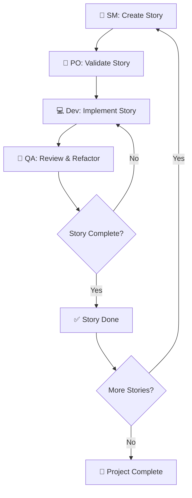

# 🇻🇳 BMad Method - Hướng Dẫn Toàn Diện Tiếng Việt

> **Phương pháp phát triển phần mềm hiện đại với sự hỗ trợ của AI Agents chuyên nghiệp**

---

## 📋 **Mục Lục**

- [🎯 Section 1: Tổng Quan BMad Method](#-section-1-tổng-quan-bmad-method)
- [🚀 Section 2: Workflow Từ Ý Tưởng → Sản Phẩm](#-section-2-workflow-từ-ý-tưởng--sản-phẩm)  
- [🔧 Section 3: Các Scenarios Thực Tế](#-section-3-các-scenarios-thực-tế)
- [📖 Section 4: Cầm Tay Chỉ Việc](#-section-4-cầm-tay-chỉ-việc)
- [🎯 Section 5: Ví Dụ Thực Tế - Todo App + Trello](#-section-5-ví-dụ-thực-tế---todo-app--trello)

---

## 🎯 **Section 1: Tổng Quan BMad Method**

### **BMad Method là gì?**

BMad Method là một phương pháp phát triển phần mềm hiện đại kết hợp:
- **Agile principles** - Phát triển linh hoạt, iterative
- **AI-powered agents** - 7 chuyên gia AI hỗ trợ từng giai đoạn
- **Document-driven development** - Tài liệu là trung tâm workflow
- **Context management** - Agents nhớ context qua các sessions

### **Tại sao nên sử dụng BMad Method?**

#### **✅ Ưu điểm vượt trội:**

1. **Structured Workflow** - Quy trình rõ ràng từ ý tưởng → code
2. **Role Specialization** - Mỗi agent chuyên về 1 lĩnh vực cụ thể  
3. **Consistency** - Templates đảm bảo output đồng nhất
4. **Scalability** - Có thể handle từ project nhỏ đến enterprise
5. **Context Persistence** - Agents nhớ công việc qua nhiều sessions
6. **Quality Assurance** - Built-in review và testing workflow

#### **📊 So sánh với các phương pháp khác:**

| **Aspect** | **BMad Method** | **Traditional Agile** | **Solo AI Agent** |
|------------|-----------------|----------------------|-------------------|
| **Structure** | ✅ Highly structured | ⚠️ Varies by team | ❌ Ad-hoc |
| **Consistency** | ✅ Template-driven | ⚠️ Team dependent | ❌ Variable quality |
| **Context Management** | ✅ Document-based persistence | ❌ Memory dependent | ❌ Single session |
| **Role Clarity** | ✅ 7 specialized agents | ⚠️ Human roles overlap | ❌ One agent does all |
| **Scalability** | ✅ Scales with complexity | ⚠️ Team dependent | ❌ Limited context |

### **Khi nào nên sử dụng BMad Method?**

#### **✅ Nên dùng khi:**
- Projects phức tạp (3+ weeks development)
- Cần tài liệu chi tiết và maintainable  
- Team development hoặc long-term maintenance
- Muốn code quality cao và consistent
- Dự án có khả năng scale up sau này

#### **❌ Không cần khi:**
- Quick prototypes (< 1 week)
- One-off scripts hoặc tools đơn giản
- Learning projects cá nhân
- Chỉ cần proof of concept

### **7 AI Agents Chuyên Nghiệp**

| **Agent** | **Tên** | **Chuyên Môn** | **Khi Nào Sử Dụng** |
|-----------|---------|----------------|---------------------|
| **📊 Analyst** | **Cô Mai** | Market research, brainstorming, competitor analysis | Giai đoạn research ý tưởng |
| **📋 PM** | **Anh Huy** | PRD creation, product strategy, requirements | Tạo tài liệu sản phẩm |
| **🎨 UX Expert** | **Chị Lan** | UI/UX design, user research, wireframes | Thiết kế trải nghiệm người dùng |
| **🏗️ Architect** | **Anh Kiến** | System design, tech stack, architecture | Thiết kế hệ thống |
| **🏃 SM** | **Anh Minh** | Story creation, sprint planning, Agile process | Quản lý stories và sprints |
| **📝 PO** | **Chị Linh** | Backlog management, validation, document sharding | Validation và organization |
| **💻 Dev** | **Anh Tuấn** | Code implementation, testing, debugging | Lập trình thực tế |
| **🧪 QA** | **Anh Quang** | Code review, refactoring, quality assurance | Đảm bảo chất lượng |

---

## 🚀 **Section 2: Workflow Từ Ý Tưởng → Sản Phẩm**

### **🎯 Overview: 2-Phase Workflow**

BMad Method chia làm 2 giai đoạn chính:


### **📋 Phase 1: Planning (Trên Web hoặc IDE)**

#### **Bước 1: Research & Analysis**
```
💡 Ý tưởng → 📊 /analyst → Project Brief
```
- **Input:** Ý tưởng ban đầu
- **Process:** Market research, competitor analysis
- **Output:** Project Brief document
- **Thời gian:** 30-60 phút

#### **Bước 2: Product Requirements**  
```
📋 Project Brief → 📋 /pm → PRD Complete
```
- **Input:** Project Brief  
- **Process:** Create PRD với FRs, NFRs, Epics, Stories
- **Output:** Product Requirements Document
- **Thời gian:** 1-2 giờ

#### **Bước 3: UX Design (Optional)**
```
📋 PRD → 🎨 /ux-expert → UI/UX Specs
```
- **Input:** PRD requirements
- **Process:** UI/UX design, wireframes, user flows
- **Output:** Front-end specifications
- **Thời gian:** 1-3 giờ (tùy complexity)

#### **Bước 4: System Architecture**
```
📋 PRD + 🎨 UX Specs → 🏗️ /architect → Architecture
```
- **Input:** PRD + UX specifications  
- **Process:** Tech stack, system design, patterns
- **Output:** Architecture document
- **Thời gian:** 1-2 giờ

#### **Bước 5: Validation & Sharding**
```
📋📋📋 All Docs → 📝 /po → Validated & Sharded
```
- **Input:** PRD + Architecture + UX specs
- **Process:** Master checklist, document sharding
- **Output:** Ready-to-develop documents
- **Thời gian:** 30 phút

### **💻 Phase 2: Development (Trong IDE)**

#### **Development Cycle Loop:**



#### **Bước 1: Story Creation**
```
📋 Sharded Docs → 🏃 /sm → User Stories
```
- **Input:** Epic từ PRD + Architecture guidance
- **Process:** Tạo detailed user stories với acceptance criteria
- **Output:** Ready-to-implement stories
- **Frequency:** Mỗi sprint/iteration

#### **Bước 2: Story Validation**  
```
📝 Draft Story → 📝 /po → Validated Story
```
- **Input:** Story draft từ SM
- **Process:** Kiểm tra completeness, dependencies, clarity
- **Output:** Approved story ready cho development
- **Frequency:** Trước mỗi story implementation

#### **Bước 3: Implementation**
```
✅ Approved Story → 💻 /dev → Working Code + Tests
```
- **Input:** Validated user story
- **Process:** Code implementation, unit tests, integration
- **Output:** Feature complete với tests passing
- **Frequency:** Liên tục trong development

#### **Bước 4: Quality Review**
```
💻 Code Complete → 🧪 /qa → Production Ready
```
- **Input:** Implemented code từ Dev
- **Process:** Senior code review, refactoring, additional tests
- **Output:** Production-quality code
- **Frequency:** Sau mỗi story implementation

### **📊 Timeline Estimate**

#### **Small Project (1-2 features):**
- Planning: 2-4 giờ
- Development: 1-2 tuần  
- Total: 1-2 tuần

#### **Medium Project (5-10 features):**
- Planning: 4-8 giờ
- Development: 3-6 tuần
- Total: 1-2 tháng

#### **Large Project (20+ features):**
- Planning: 1-2 ngày
- Development: 2-6 tháng
- Total: 3-6 tháng

---

## 🔧 **Section 3: Các Scenarios Thực Tế**

### **🌱 Scenario 1: Greenfield Project (Dự án mới)**

> **Tình huống:** Bạn có ý tưởng app mới, bắt đầu từ con số 0

#### **Workflow:**
```
💡 Ý tưởng → 📊 Analysis → 📋 PRD → 🎨 UX → 🏗️ Architecture → 🏃 Stories → 💻 Code → 🚀 Deploy
```

#### **Commands sequence:**
```bash
# Step 1: Research ý tưởng
/analyst
*create-project-brief

# Step 2: Tạo PRD  
/pm
*create-prd

# Step 3: UX Design (if needed)
/ux-expert  
*create-front-end-spec

# Step 4: System Architecture
/architect
*create-architecture

# Step 5: Validate & Shard
/po
*execute-checklist-po
*shard-doc docs/prd.md docs/prd
*shard-doc docs/architecture.md docs/architecture

# Step 6: Development Loop
/sm → *draft (create stories)
/dev → *develop-story (implement)  
/qa → *review (quality check)
```

#### **Thời gian:** 
- Planning: 4-8 giờ
- Development: Tùy scope (1 tuần - 6 tháng)

---

### **🏗️ Scenario 2: Brownfield Project (Nâng cấp dự án có sẵn)**

> **Tình huống:** Bạn có app/website existing, muốn thêm features mới

#### **Đặc điểm:**
- Code base đã có sẵn
- Architecture đã định hình
- Cần integrate với existing systems

#### **Workflow:**
```
📋 Existing App → 📊 Analysis → 📝 Epic Creation → 🏃 Stories → 💻 Code → 🚀 Deploy  
```

#### **Commands sequence:**
```bash
# Step 1: Document existing system  
/analyst
*document-project

# Step 2: Create new epic
/pm  
*create-brownfield-epic

# Step 3: Validate against existing
/po
*validate-story-draft

# Step 4: Development
/sm → *draft  
/dev → *develop-story
/qa → *review
```

#### **Thời gian:**
- Analysis: 2-4 giờ
- Development: Nhanh hơn greenfield (20-50%)

---

### **🐛 Scenario 3: Bug Fixing & Maintenance**

> **Tình huống:** App có bugs cần fix hoặc performance issues

#### **Workflow:**
```
🐛 Bug Report → 🏃 Story Creation → 💻 Fix Implementation → 🧪 QA Review → ✅ Deploy
```

#### **Commands sequence:**
```bash
# Step 1: Create bug fix story
/sm
*draft  # Tạo story mô tả bug + fix approach

# Step 2: Implement fix
/dev  
*develop-story  # Fix bug + add tests

# Step 3: Senior review
/qa
*review  # Ensure fix không break other features
```

#### **Thời gian:** 
- Simple bugs: 2-4 giờ
- Complex issues: 1-3 ngày

---

### **⚡ Scenario 4: Feature Enhancement**

> **Tình huống:** Improve existing feature hoặc optimize performance

#### **Workflow:**
```
📊 Analysis → 📋 Enhancement Plan → 💻 Implementation → 🧪 QA → 🚀 Deploy
```

#### **Commands sequence:**
```bash
# Step 1: Analyze current state
/analyst
*brainstorm {feature-improvement}

# Step 2: Plan enhancement  
/pm
*create-brownfield-story

# Step 3: Implement improvement
/dev
*develop-story

# Step 4: Quality review
/qa  
*review  # Ensure performance gains
```

#### **Thời gian:**
- Minor enhancements: 4-8 giờ
- Major improvements: 1-2 tuần

---

### **🔄 Scenario 5: Continuous Development**

> **Tình huống:** Long-term project với regular releases

#### **Workflow:**
```
Sprint Planning → Story Implementation → QA Review → Release → Retrospective → Repeat
```

#### **Monthly cycle:**
```bash
# Week 1: Sprint Planning
/po → *execute-checklist-po
/sm → *draft (multiple stories for sprint)

# Week 2-3: Development  
/dev → *develop-story (story 1)
/qa → *review  
/dev → *develop-story (story 2)
/qa → *review

# Week 4: Release & Retrospective
/po → validation & documentation
Deploy to production
/sm → retrospective & planning next sprint
```

#### **Benefits:**
- Predictable delivery schedule
- Continuous quality improvement  
- Regular stakeholder feedback
- Sustainable development pace

---

## 📖 **Section 4: Cầm Tay Chỉ Việc**

### **🚀 Getting Started**

#### **Bước 1: Setup Project**
```bash
# Tạo project mới
mkdir my-awesome-project
cd my-awesome-project

# Install BMad Method
npx bmad-method install

# Hoặc copy từ existing project
cp -r /path/to/bmad-project/.bmad-core .
cp -r /path/to/bmad-project/.claude .
```

#### **Bước 2: Verify Installation**
```bash
# Check agents có hoạt động không
/analyst  # Should greet "Xin chào! Tôi là Cô Mai..."
*exit

/pm       # Should greet "Xin chào! Tôi là Anh Huy..."  
*exit
```

#### **Bước 3: Configure Project**
```bash
# Edit core config
nano .bmad-core/core-config.yaml

# Customize technical preferences  
nano .bmad-core/data/technical-preferences.md
```

### **📋 Commands Reference**

#### **🔍 Discovery Commands:**

##### **📊 Analyst (Cô Mai):**
```bash
/analyst
*help                           # Show all commands
*create-project-brief          # Tạo project brief từ ý tưởng
*perform-market-research       # Nghiên cứu thị trường  
*create-competitor-analysis    # Phân tích đối thủ
*brainstorm {topic}           # Brainstorming session
*research-prompt {topic}      # Tạo research prompts
*exit                         # Thoát
```

**Example Usage:**
```bash
/analyst
*brainstorm "Todo app with AI features"
# → Cô Mai sẽ facilitate brainstorming session
# → Output: List of features, user personas, market opportunities

*create-project-brief  
# → Interactive process tạo project brief
# → Output: docs/project-brief.md
```

##### **📋 Product Manager (Anh Huy):**
```bash
/pm  
*help                          # Show all commands
*create-prd                   # Tạo Product Requirements Document
*create-brownfield-prd        # PRD cho dự án có sẵn  
*shard-prd                    # Chia PRD thành files nhỏ
*create-epic                  # Tạo epic mới
*create-story                 # Tạo user story
*correct-course               # Điều chỉnh direction
*yolo                         # Toggle fast mode
*exit                         # Thoát
```

**Example Usage:**
```bash
/pm
*create-prd
# → Interactive PRD creation process
# → Hỏi về goals, requirements, features
# → Output: docs/prd.md

*shard-prd
# → Chia PRD thành multiple files  
# → Output: docs/prd/goals.md, docs/prd/features.md, etc.
```

#### **🎨 Design Commands:**

##### **🎨 UX Expert (Chị Lan):**
```bash
/ux-expert
*help                          # Show all commands  
*create-front-end-spec        # Tạo front-end specification
*generate-ui-prompt           # Tạo AI UI generation prompts
*exit                         # Thoát
```

**Example Usage:**
```bash
/ux-expert  
*create-front-end-spec
# → Interactive UX design process
# → Output: docs/frontend-spec.md with wireframes, user flows

*generate-ui-prompt
# → Tạo prompts cho v0.dev hoặc Lovable
# → Output: Optimized prompts cho AI UI tools
```

#### **🏗️ Development Commands:**

##### **🏃 Scrum Master (Anh Minh):**
```bash
/sm
*help                          # Show all commands
*draft                        # Tạo story tiếp theo từ epic  
*correct-course               # Điều chỉnh hướng dự án
*story-checklist             # Kiểm tra story quality
*exit                         # Thoát
```

**Example Usage:**
```bash
/sm
*draft
# → Đọc PRD và architecture
# → Tạo detailed user story với acceptance criteria
# → Output: docs/stories/story-1-1.md
```

##### **📝 Product Owner (Chị Linh):**  
```bash
/po
*help                          # Show all commands
*execute-checklist-po         # Chạy master checklist
*shard-doc {doc} {dest}       # Chia document thành parts
*validate-story-draft {story} # Validate story quality  
*create-epic                  # Tạo epic cho brownfield
*correct-course               # Điều chỉnh course
*yolo                         # Toggle confirmations
*exit                         # Thoát
```

**Example Usage:**
```bash
/po
*shard-doc docs/prd.md docs/prd
# → Automatically chia PRD thành:
# → docs/prd/goals.md
# → docs/prd/features.md  
# → docs/prd/technical-requirements.md

*validate-story-draft docs/stories/story-1-1.md
# → Check story completeness
# → Validate against PRD requirements
```

##### **💻 Developer (Anh Tuấn):**
```bash
/dev
*help                          # Show all commands
*develop-story                # Implement story end-to-end  
*run-tests                    # Chạy tests và linting
*explain                      # Giải thích code vừa viết
*exit                         # Thoát
```

**Example Usage:**
```bash
/dev  
*develop-story
# → Đọc story requirements
# → Implement từng task sequentially  
# → Write tests
# → Update story với progress
# → Mark story "Ready for Review"
```

##### **🧪 QA Engineer (Anh Quang):**
```bash
/qa
*help                          # Show all commands
*review {story}               # Review code và refactor
*exit                         # Thoát
```

**Example Usage:**
```bash
/qa
*review docs/stories/story-1-1.md  
# → Review code từ dev
# → Active refactoring với explanations
# → Update "QA Results" section
# → Mark "Approved" hoặc "Changes Required"
```

### **🔄 Typical Workflows**

#### **🌱 New Feature Workflow:**
```bash
# 1. Plan feature
/analyst
*brainstorm "user authentication system"

# 2. Create requirements  
/pm
*create-prd

# 3. Design UX (if needed)
/ux-expert
*create-front-end-spec  

# 4. Create stories
/sm  
*draft

# 5. Validate story
/po
*validate-story-draft docs/stories/story-1-1.md

# 6. Implement
/dev
*develop-story

# 7. Quality review  
/qa
*review docs/stories/story-1-1.md
```

#### **🐛 Bug Fix Workflow:**
```bash
# 1. Create bug story
/sm
*draft  # Describe bug + fix approach

# 2. Implement fix  
/dev
*develop-story  # Fix + tests

# 3. Senior review
/qa  
*review  # Ensure no regressions
```

#### **📊 Project Health Check:**
```bash
# Check document alignment
/po
*execute-checklist-po

# Review code quality
/qa  
*review  # Review latest stories

# Plan next iteration
/sm
*draft   # Create next stories
```

### **📁 File Structure**

```
my-project/
├── .bmad-core/                 # BMad Method core files
│   ├── agents/                 # Agent definitions  
│   ├── tasks/                  # Workflow tasks
│   ├── templates/              # Document templates
│   ├── data/                   # Knowledge base
│   └── core-config.yaml        # Main config
├── .claude/                    # Claude Code config
│   └── commands/BMad/          # Agent command definitions
├── docs/                       # Project documentation
│   ├── prd.md                  # Product Requirements
│   ├── architecture.md         # System Architecture  
│   ├── prd/                    # Sharded PRD files
│   ├── architecture/           # Sharded architecture files
│   └── stories/                # User stories
├── src/                        # Source code  
└── README.md                   # Project overview
```

### **⚙️ Configuration**

#### **Core Config (.bmad-core/core-config.yaml):**
```yaml
# Files Dev agent luôn load
devLoadAlwaysFiles:
  - docs/architecture/coding-standards.md
  - docs/architecture/tech-stack.md  
  - docs/architecture/project-structure.md

# PRD configuration  
prd:
  prdFile: docs/prd.md
  prdSharded: true
  prdShardedLocation: docs/prd

# Architecture configuration
architecture:
  architectureFile: docs/architecture.md
  architectureSharded: true  
  architectureShardedLocation: docs/architecture

# Story location
devStoryLocation: docs/stories
```

#### **Technical Preferences (.bmad-core/data/technical-preferences.md):**
```markdown
# Technical Preferences

## Frontend
- Framework: React with TypeScript
- State Management: Zustand  
- Styling: Tailwind CSS
- UI Components: shadcn/ui

## Backend  
- Runtime: Node.js
- Framework: Express.js  
- Database: PostgreSQL
- ORM: Prisma

## Testing
- Unit Tests: Jest
- Integration Tests: Supertest  
- E2E Tests: Playwright

## Deployment
- Platform: Vercel (Frontend) + Railway (Backend)
- Database: Neon PostgreSQL
```

### **💡 Tips & Best Practices**

#### **🎯 Productivity Tips:**

1. **Use YOLO Mode for speed:**
   ```bash
   /po
   *yolo  # Skip confirmations
   ```

2. **Batch similar operations:**  
   ```bash
   /sm
   *draft  # Create multiple stories
   *draft
   *draft  
   ```

3. **Regular health checks:**
   ```bash
   /po  
   *execute-checklist-po  # Weekly checks
   ```

#### **📋 Quality Tips:**

1. **Always validate stories:**
   ```bash
   /po
   *validate-story-draft {story}  # Before development
   ```

2. **Use QA for all code:**
   ```bash
   /qa
   *review  # Never skip QA review
   ```

3. **Keep documents updated:**
   ```bash
   /po
   *shard-doc  # After major PRD changes
   ```

#### **🔄 Workflow Tips:**

1. **Start small, iterate:**
   - Begin với 1-2 core features
   - Add complexity gradually
   - Regular user feedback

2. **Maintain document quality:**
   - Sharded documents load faster
   - Keep technical preferences updated
   - Regular architecture reviews

3. **Use agents' strengths:**
   - Analyst: Broad research and ideation
   - PM: Structured requirements  
   - Dev: Focused implementation
   - QA: Quality and mentorship

### **🚨 Troubleshooting**

#### **Common Issues:**

**Issue: Agent không nhớ context**
```bash
# Solution: Check document structure
/po  
*execute-checklist-po  # Verify documents aligned
```

**Issue: Stories thiếu details**
```bash  
# Solution: Better validation
/po
*validate-story-draft {story}  # Before development
```

**Issue: Code quality inconsistent**  
```bash
# Solution: Always use QA
/qa
*review  # Don't skip reviews
```

**Issue: Development quá chậm**
```bash
# Solution: Check story size
/sm
*draft  # Break down large stories
```

#### **Performance Optimization:**

1. **Document sharding:**
   ```bash
   /po
   *shard-doc docs/prd.md docs/prd
   ```

2. **Use technical preferences:**
   - Update `.bmad-core/data/technical-preferences.md`
   - Agents sẽ follow preferences

3. **Regular cleanup:**  
   - Remove unused files
   - Archive completed stories
   - Update core config

---

*Tiếp tục với Section 5...*